# 🎵 SoundCraft

**SoundCraft** is a multi-agent AI system for audio source separation, mixing and post-processing controlled with natural language.

A single **DeepSeek LLM** powers the LangGraph orchestrator, which interprets user requests and delegates audio-processing tasks to specialized model agents.

SoundCraft combines:

- **DeepSeek** — single reasoning LLM
- **LangGraph** — multi-agent orchestration
- **custom genetic-algorithm-inspired model ranking**
- **BS-RoFormer** and **Demucs**
- automatic routing and fallback
- **mixAgent**, **Pedalboard / DSP** and **PostProcessing**
- **FastAPI** + **React / Vite**
- **WCSS / Slurm** GPU execution

---

## 🖥️ Interface

### Upload audio

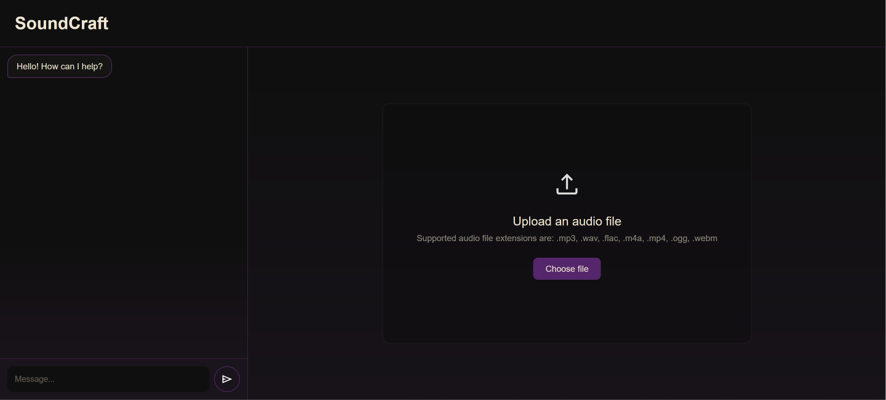

### Audio workspace

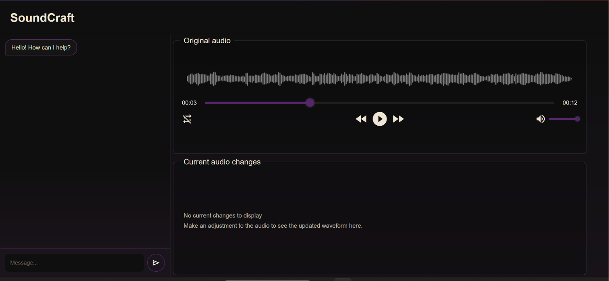

### Processed audio

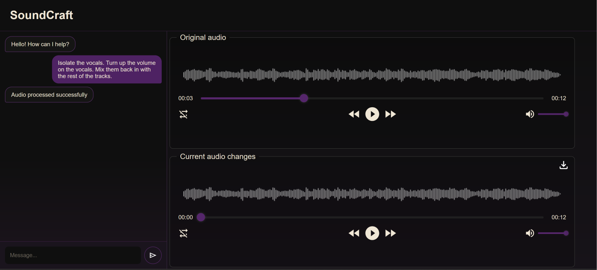

Example commands:

```text
isolate the vocals
extract the guitar
make the vocals louder
```

Polish commands are supported as well:

```text
wyciągnij wokal
wyodrębnij dźwięk gitary
zrób wokal głośniej
```

---

## 🧠 Architecture

SoundCraft uses **one DeepSeek LLM**. The audio agents are specialized workers, not separate language models.

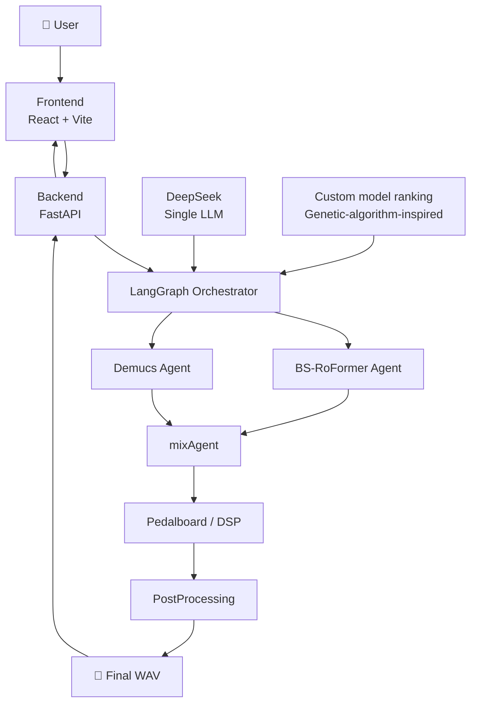

### Main components

| Component | Description |
|---|---|
| `SoundCraft_frontend` | React/Vite web interface |
| `SoundCraft_backend` | FastAPI backend |
| `llm_agent` | LangGraph orchestrator powered by DeepSeek |
| `agent_bs_roformer` | BS-RoFormer execution agent |
| `demucs` | Demucs source-separation integration |
| `mixAgent` | Mixing and audio effects |
| `PostProcessing` | Final audio-processing stage |

---

## 🤖 Multi-agent workflow

The orchestrator interprets the request, selects a compatible model and receives a structured result from its agent.

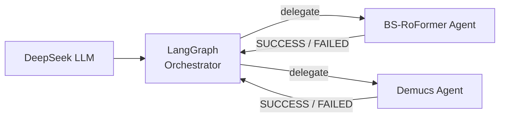

The orchestrator handles:

- task classification,
- agent selection,
- model ranking,
- failure handling,
- fallback selection.

Agents handle model-specific execution and return `SUCCESS` or `FAILED`.

---

## 🧬 Custom genetic-algorithm-inspired ranking

SoundCraft uses a **custom model-selection mechanism inspired by genetic algorithms**.

Instead of hardcoding model priority, models are ranked using benchmark-derived fitness values.

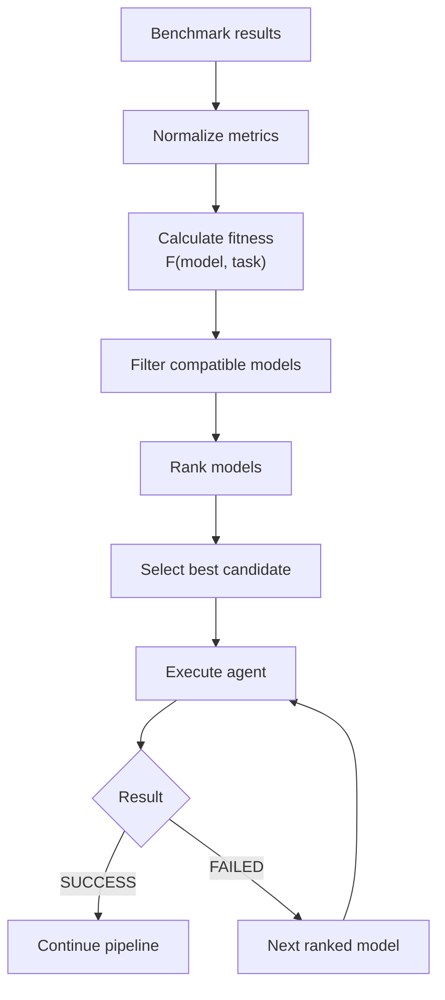

| Genetic algorithm concept | SoundCraft |
|---|---|
| Population | Available audio models |
| Individual | Model + execution agent |
| Fitness | Benchmark-derived performance |
| Ranking selection | Models ordered by fitness |
| Elitism | Best compatible model selected first |
| Elimination | Unsupported models filtered out |
| New generation | Ranking recalculated when model data changes |

The generalized fitness function is:

```text
F(m, s) = Σ wk · normk(m, s)
```

where `m` is a model, `s` is a task or stem, `normk` is a normalized metric and `wk` is its weight.

Unlike a classical genetic algorithm, the mechanism is **deterministic** and does not use crossover or mutation. The models do not evolve — their **ranking does** when benchmark data changes.

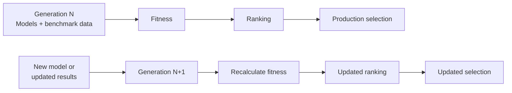

---

## 🔁 Routing and fallback

If the selected model fails, SoundCraft moves to the next compatible model in the ranking.

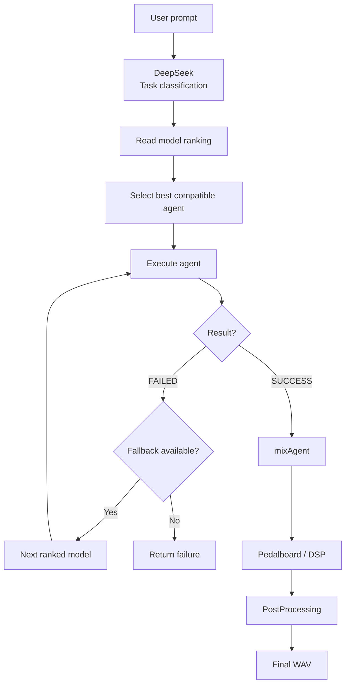

---

## 🎚️ Audio processing

The active audio pipeline uses:

- **BS-RoFormer**
- **Demucs**
- **mixAgent**
- **Pedalboard / DSP**
- **PostProcessing**

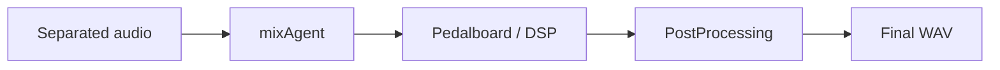

> **SAM Audio is currently excluded from the active processing pipeline.**

---

## 🚀 Local demo

The local demo runs without WCSS or a GPU.

```bash
python3 -m venv .venv-ui
source .venv-ui/bin/activate

python -m pip install -r requirements-ui.txt

cd SoundCraft_frontend
npm install
cd ..

python run_ui.py --demo
```

Open:

```text
http://127.0.0.1:5173
```

In demo mode, GPU-heavy execution is simulated while the application pipeline remains active:

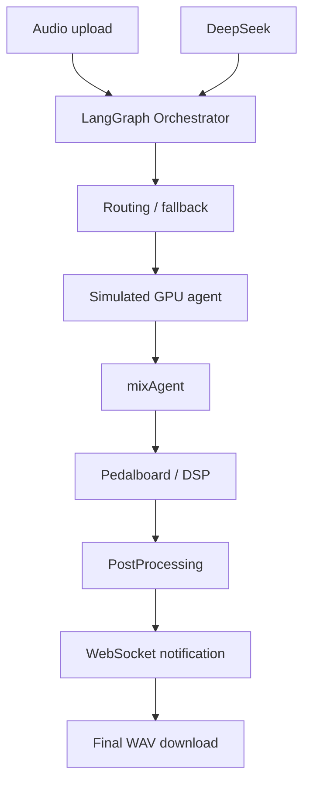

Press `Ctrl+C` to stop the local processes.

---

## 🔐 Configuration

Create a private configuration:

```bash
cp llm_agent/config.yaml llm_agent/config.local.yaml
chmod 600 llm_agent/config.local.yaml
```

Configure:

- DeepSeek API key,
- WCSS paths,
- Slurm account / QoS / partition,
- BS-RoFormer paths and checkpoint,
- Demucs environment,
- SFTP / rsync,
- SSH authentication,
- callback URL and token.

The request paths must point to the same WCSS directory:

```text
paths.request_root == backend.sftp_remote_path == backend.rsync_remote_path
```

> Never commit API keys, SSH keys or authentication tokens.

---

## 🖥️ WCSS setup

```bash
cd /home/USER

git clone REPOSITORY_URL SoundCraft
cd SoundCraft

python3 -m venv .venv-orchestrator
source .venv-orchestrator/bin/activate

python -m pip install -r llm_agent/requirements.txt
```

Copy the private configuration:

```bash
scp llm_agent/config.local.yaml \
  USER@ui.wcss.pl:/home/USER/SoundCraft/llm_agent/config.local.yaml
```

### BS-RoFormer

```bash
python -m pip install -r agent_bs_roformer/requirements-agent.txt
```

Configure the model repository, YAML configuration, checkpoint and Python environment.

### Demucs

```bash
python3.11 -m venv /home/USER/venvs/demucs

source /home/USER/venvs/demucs/bin/activate

python -m pip install -r demucs/requirements.txt
```

---

## ⚙️ WCSS worker

Start the worker with:

```bash
cd /home/USER/SoundCraft

./scripts/submit_wcss_worker.sh
```

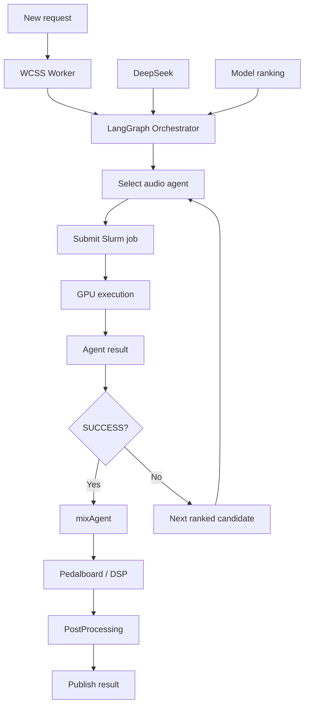

Test one existing request:

```bash
python -m llm_agent.orchestrator.wcss_request \
  /home/USER/backend_files/REQUEST_UUID \
  --config llm_agent/config.local.yaml
```

---

## 🌐 UI connected to WCSS

```bash
cd SoundCraft

python3 -m venv .venv-ui
source .venv-ui/bin/activate

python -m pip install -r requirements-ui.txt

cd SoundCraft_frontend
npm install
cd ..

python run_ui.py --config llm_agent/config.local.yaml
```

| Service | Address |
|---|---|
| Backend | `http://127.0.0.1:8000` |
| Callback gateway | `http://127.0.0.1:8001` |
| UI | `http://127.0.0.1:5173` |

Custom ports:

```bash
python run_ui.py \
  --demo \
  --backend-port 8010 \
  --frontend-port 5180
```

---

## 🌐 Production architecture

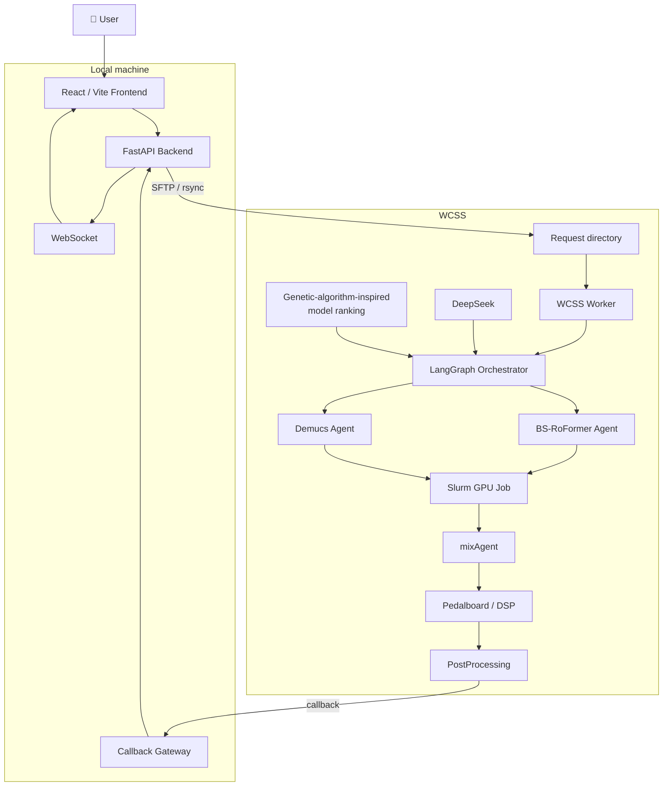

---

## 🧪 Diagnostics

```bash
# Validate configuration / one worker scan
python -m llm_agent.orchestrator.wcss_worker \
  --config llm_agent/config.local.yaml \
  --once

# Slurm jobs
squeue -u "$USER"

# Job details
sacct -j JOB_ID \
  --format=JobID,State,ExitCode,Elapsed,MaxRSS

# Tests
python -m unittest -v llm_agent.tests.test_pipeline

# Frontend build
npm --prefix SoundCraft_frontend run build
```

Common problems:

| Problem | Possible cause |
|---|---|
| `NO_RESOURCES` | No GPU resources or incorrect Slurm configuration |
| Long `PENDING` | Queue, partition or QoS |
| `FILE_NOT_FOUND` | Incorrect model/checkpoint path |
| UI stays on `processing` | Worker or request-path configuration issue |
| DeepSeek request fails | API key or connectivity problem |

---

## 📁 Repository structure

```text
SoundCraft/
├── PostProcessing/
├── SoundCraft_backend/
├── SoundCraft_frontend/
├── agent_bs_roformer/
├── demucs/
├── llm_agent/
├── mixAgent/
├── screenshots/
├── scripts/
├── INSTRUKCJA_URUCHOMIENIA.md
├── WCSS_ODTWORZENIE.md
├── requirements-ui.txt
├── run_ui.py
├── LICENSE
└── README.md
```

---

## 🧰 Technology stack

**AI / orchestration:** DeepSeek, LangGraph, custom genetic-algorithm-inspired ranking  
**Audio:** BS-RoFormer, Demucs, Pedalboard, DSP  
**Backend:** Python, FastAPI, WebSocket, Paramiko, SFTP / rsync  
**Frontend:** React, Vite  
**Infrastructure:** WCSS, Slurm, GPU jobs, SSH

---

## 📌 Current active pipeline

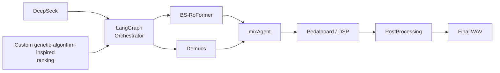

---

## 📚 Documentation

- [Setup and deployment](INSTRUKCJA_URUCHOMIENIA.md)
- [LLM orchestrator](llm_agent/README.md)
- [WCSS environment recreation](WCSS_ODTWORZENIE.md)
- [Additional documentation](manual.md)

---

## 📜 License

SoundCraft is licensed under the [MIT License](LICENSE).
