# 🎵 SoundCraft

**SoundCraft** is a multi-agent AI system for audio source separation, mixing and post-processing controlled with natural language.

The system uses a single **DeepSeek LLM** as the reasoning engine of the orchestrator. DeepSeek interprets the user's request, classifies the task and coordinates specialized audio-processing agents.

The audio agents are **not separate LLMs**. They are specialized workers responsible for executing audio models, monitoring their jobs and returning structured results to the orchestrator.

SoundCraft combines:

- **DeepSeek** — single reasoning LLM
- **LangGraph** — multi-agent orchestration
- **custom genetic-algorithm-inspired model ranking**
- **BS-RoFormer**
- **Demucs**
- automatic model routing and fallback
- **mixAgent**
- **Pedalboard / DSP**
- **PostProcessing**
- **FastAPI**
- **React / Vite**
- **WCSS / Slurm** GPU execution

---

## 🖥️ Interface

### Upload audio

Upload an audio file directly through the web interface.


---

### Audio workspace

After uploading a file, SoundCraft displays the original waveform and opens the natural-language control interface.


---

### AI-controlled audio processing

The user describes the desired result in the chat interface.

SoundCraft interprets the request, selects the processing path, executes the audio pipeline and returns the processed file.


---

## 💬 Example commands

```text
isolate the vocals
extract the guitar
make the vocals louder
```

Commands can also be provided in Polish:

```text
wyciągnij wokal
wyodrębnij dźwięk gitary
zrób wokal głośniej
```

---

## 🧠 Architecture

SoundCraft uses **one DeepSeek LLM** for natural-language interpretation and orchestration.

The multi-agent architecture consists of a central LangGraph orchestrator and specialized model workers.

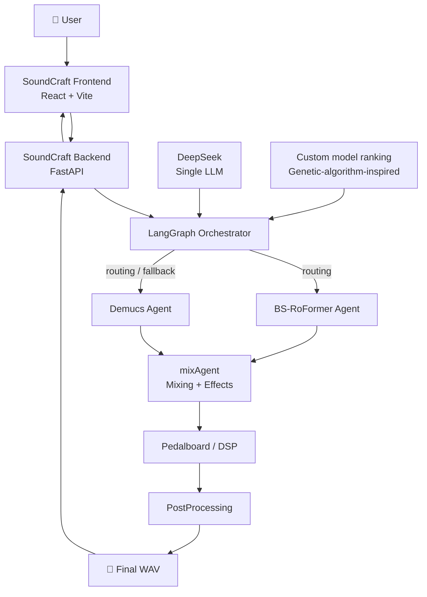

The orchestrator is responsible for high-level decisions.

The audio agents are responsible for model-specific execution.

---

## 🔄 Processing pipeline

A typical SoundCraft request follows this path:

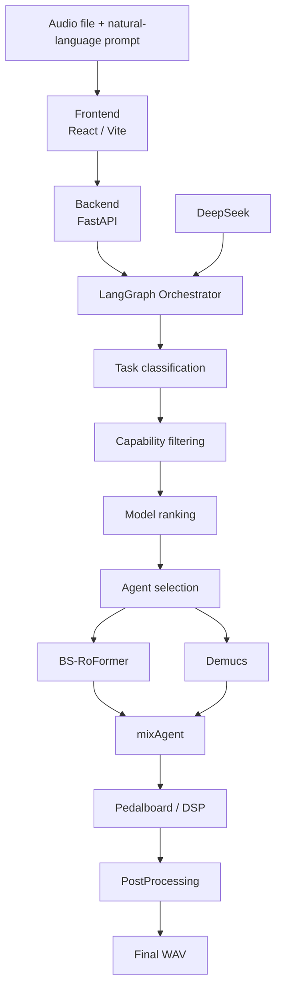

---

## 🤖 Multi-agent design

SoundCraft is a multi-agent system even though it uses only **one language model**.

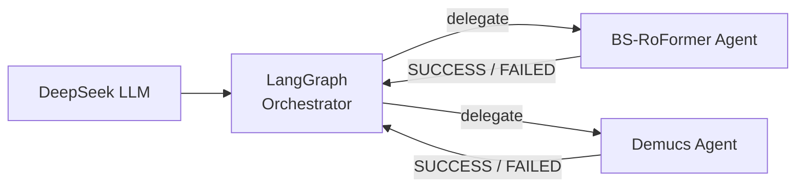

### Orchestrator

The DeepSeek-powered orchestrator is responsible for:

- interpreting the user's request,
- classifying the requested operation,
- checking which models are capable of performing the task,
- reading the model ranking,
- selecting an appropriate audio-processing agent,
- tracking previous attempts,
- handling failures,
- selecting another compatible model when necessary,
- coordinating the complete processing pipeline.

### Audio agents

Each model-specific agent is responsible for:

- handling one audio-processing model,
- validating whether the requested task is supported,
- preparing model execution,
- submitting computation,
- monitoring execution,
- reading the generated output,
- returning a structured `SUCCESS` or `FAILED` report.

This separates **reasoning and orchestration** from **model-specific execution**.

---

# 🧬 Custom genetic-algorithm-inspired model ranking

SoundCraft includes a **custom model-selection algorithm inspired by genetic algorithms**.

Instead of hardcoding a fixed priority such as:

```text
Model A > Model B > Model C
```

the system derives the model hierarchy from performance data.

Each audio model is treated similarly to an **individual in a population**, while its benchmark performance determines its **fitness**.

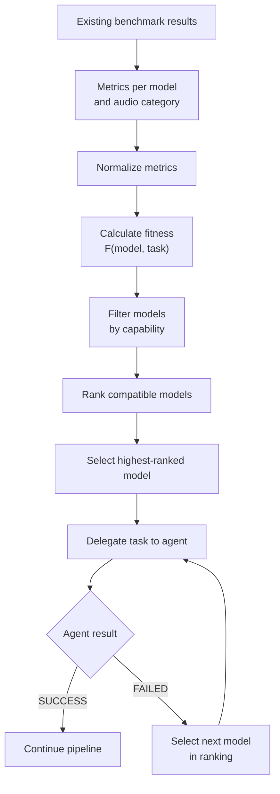

## Genetic-algorithm mapping

| Genetic algorithm concept | SoundCraft |
|---|---|
| Population | Available audio models |
| Individual | Audio model together with its execution agent |
| Fitness function | Performance calculated from benchmark metrics |
| Ranking selection | Models ordered by fitness |
| Elitism | Highest-ranked compatible model receives the task first |
| Elimination | Models unable to perform the requested task are filtered out |
| Selection after failure | Next compatible model in the ranking |
| New generation | Ranking recalculated when model data changes |

A generalized fitness function can be represented as:

```text
F(m, s) = Σ wk · normk(m, s)
```

where:

- `m` — audio model,
- `s` — stem or task category,
- `k` — evaluation metric,
- `normk` — normalized value of metric `k`,
- `wk` — weight assigned to metric `k`.

The ranking can be calculated separately for different audio tasks.

This means that one model can rank highest for one type of source while another model can rank higher for another task.

---

## Deterministic ranking selection

Unlike a classical genetic algorithm, SoundCraft does not randomly select an individual.

The highest-ranked compatible model receives the request first.

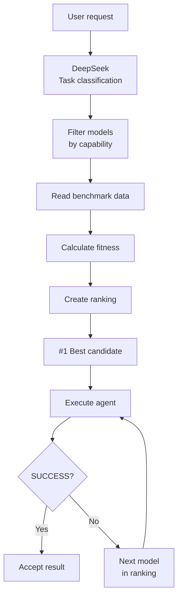

The mechanism is therefore:

- **data-driven**
- **deterministic**
- **reproducible**
- **independent of manually hardcoded model priority**

The LLM does not calculate the numerical fitness itself.

Fitness values and ranking are calculated by application logic from benchmark data. The orchestrator uses the resulting ranking when deciding which agent should receive the task.

---

## Why genetic-algorithm-inspired?

The algorithm borrows several concepts from genetic algorithms:

- population,
- individuals,
- fitness,
- ranking selection,
- elitism,
- elimination,
- generations.

However, SoundCraft intentionally does **not** use crossover or mutation.

The audio models themselves do not evolve.

Instead, the **model hierarchy evolves when the available models, benchmark results or fitness parameters change**.

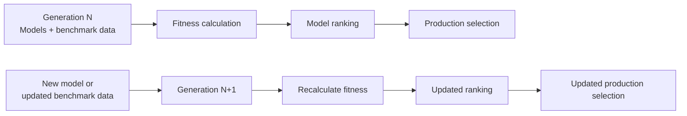

This makes it possible to add new audio models without rewriting the orchestration logic.

A new model only needs:

1. an execution agent,
2. capability information,
3. benchmark results used by the ranking algorithm.

---

# 🔁 Routing and fallback

When the selected model cannot complete a task, the orchestrator can move to the next compatible model in the ranking.

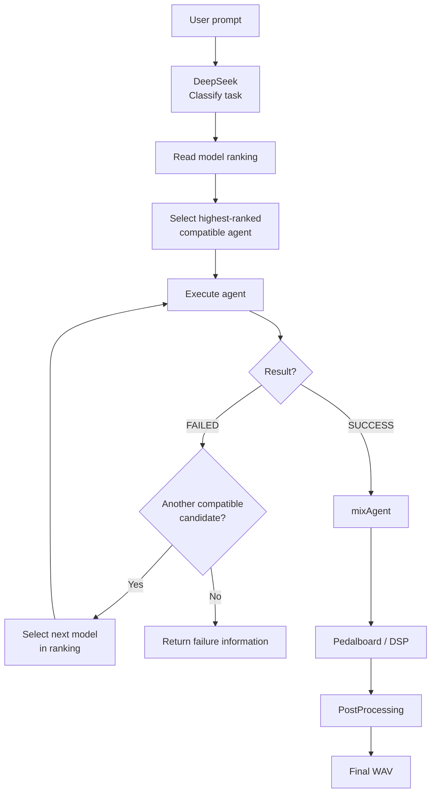

The orchestrator keeps track of previous attempts so that the same failed candidate is not repeatedly selected without a meaningful change.

---

# 🧩 Project components

| Component | Description |
|---|---|
| `SoundCraft_frontend` | React/Vite web interface |
| `SoundCraft_backend` | FastAPI backend responsible for uploads and result handling |
| `llm_agent` | LangGraph orchestrator powered by a single DeepSeek LLM |
| `agent_bs_roformer` | Specialized BS-RoFormer execution agent |
| `demucs` | Demucs source-separation integration |
| `mixAgent` | Audio mixing and effect processing |
| `PostProcessing` | Final audio-processing stage |
| `scripts` | Helper and WCSS execution scripts |
| `screenshots` | Images displayed in this README |

---

# 🎚️ Audio processing

## BS-RoFormer

BS-RoFormer is one of the source-separation models used by SoundCraft.

It is executed through a dedicated agent responsible for model-specific execution and reporting.

---

## Demucs

Demucs provides an additional source-separation path.

Depending on the task and model ranking, the orchestrator can select Demucs as the processing model or use it as a fallback candidate.

---

## mixAgent

After source separation, the resulting tracks are passed to `mixAgent`.

It is responsible for operations such as:

- volume changes,
- track recombination,
- requested mixing operations,
- audio effects,
- preparation for final processing.

---

## Pedalboard / DSP

Audio effects and signal-processing operations are handled with DSP processing and Pedalboard.

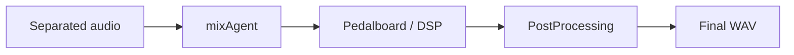

---

## PostProcessing

`PostProcessing` is the final processing stage before the result is returned to the user.

---

# 🚀 Local demo

SoundCraft includes a local demo that can be executed without WCSS or a local GPU.

From the repository root:

```bash
python3 -m venv .venv-ui
source .venv-ui/bin/activate

python -m pip install -r requirements-ui.txt

cd SoundCraft_frontend
npm install
cd ..

python run_ui.py --demo
```

Open:

```text
http://127.0.0.1:5173
```

Example commands:

```text
wyciągnij wokal
wyodrębnij dźwięk gitary
zrób wokal głośniej
```

In demo mode, GPU-heavy model execution is simulated, while the actual application infrastructure remains active:

- HTTP upload,
- orchestrator,
- routing,
- fallback handling,
- `mixAgent`,
- Pedalboard,
- `PostProcessing`,
- local WebSocket notification,
- final WAV download.

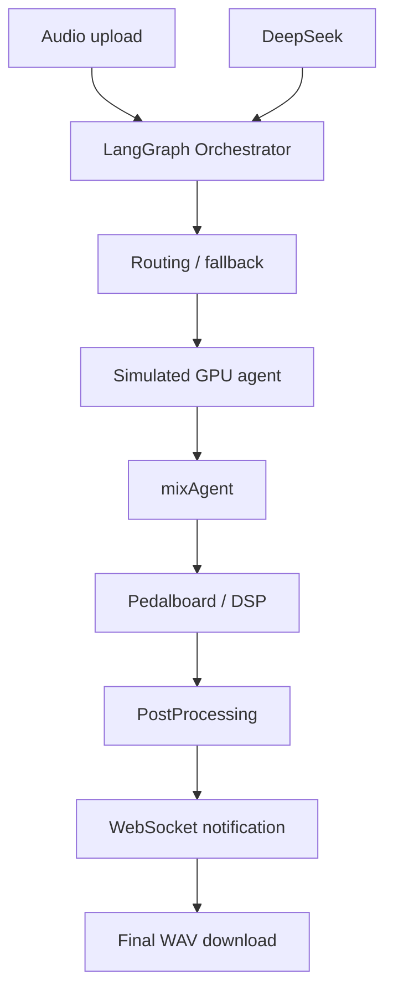

Press:

```text
Ctrl+C
```

to stop the local processes.

---

# 🔐 Configuration

Create a private configuration file:

```bash
cp llm_agent/config.yaml llm_agent/config.local.yaml
chmod 600 llm_agent/config.local.yaml
```

Edit:

```text
llm_agent/config.local.yaml
```

The configuration contains settings for:

- DeepSeek API access,
- WCSS request directory,
- Slurm account,
- QoS,
- GPU partition,
- BS-RoFormer environment,
- model configuration,
- model checkpoints,
- Demucs environment,
- SFTP / rsync backend,
- SSH authentication,
- callback URL,
- callback authentication token.

Important path dependency:

```text
paths.request_root == backend.sftp_remote_path == backend.rsync_remote_path
```

`config.local.yaml` is ignored by Git.

Environment variables take precedence over YAML configuration.

> **Never commit API keys, SSH private keys, callback tokens or private WCSS credentials.**

---

# 🖥️ WCSS setup

Clone the repository on WCSS:

```bash
cd /home/USER

git clone REPOSITORY_URL SoundCraft

cd SoundCraft
```

Create the orchestrator environment:

```bash
python3 -m venv .venv-orchestrator

source .venv-orchestrator/bin/activate

python -m pip install -r llm_agent/requirements.txt
```

Copy the private configuration:

```bash
scp llm_agent/config.local.yaml \
  USER@ui.wcss.pl:/home/USER/SoundCraft/llm_agent/config.local.yaml
```

Restrict access to the configuration:

```bash
ssh USER@ui.wcss.pl \
  chmod 600 /home/USER/SoundCraft/llm_agent/config.local.yaml
```

Update environment-specific paths inside the configuration.

---

# 🎤 BS-RoFormer setup

The BS-RoFormer configuration must point to:

- model repository,
- model YAML configuration,
- checkpoint,
- Python environment.

Install the required dependencies:

```bash
python -m pip install -r agent_bs_roformer/requirements-agent.txt
```

---

# 🎼 Demucs setup

Create a separate execution environment:

```bash
python3.11 -m venv /home/USER/venvs/demucs

source /home/USER/venvs/demucs/bin/activate

python -m pip install -r demucs/requirements.txt
```

Set the corresponding interpreter path in the private configuration.

---

# ⚙️ Running the WCSS worker

On WCSS:

```bash
cd /home/USER/SoundCraft

./scripts/submit_wcss_worker.sh
```

The worker observes the configured request directory and handles incoming jobs.

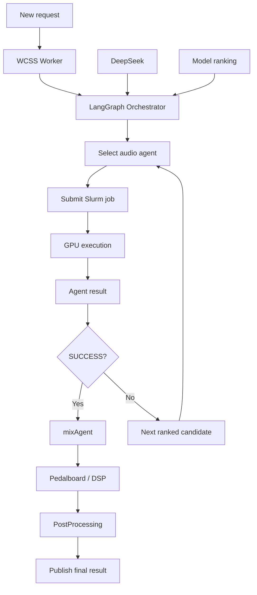

The worker itself runs as a lightweight CPU job rather than as a permanent process on the WCSS login node.

---

## Test a single request

An existing request can be executed manually:

```bash
python -m llm_agent.orchestrator.wcss_request \
  /home/USER/backend_files/REQUEST_UUID \
  --config llm_agent/config.local.yaml
```

---

# 🌐 Running the UI with WCSS

On a computer with SSH access to WCSS:

```bash
cd SoundCraft

python3 -m venv .venv-ui
source .venv-ui/bin/activate

python -m pip install -r requirements-ui.txt

cd SoundCraft_frontend
npm install
cd ..

python run_ui.py --config llm_agent/config.local.yaml
```

The launcher starts:

| Service | Address |
|---|---|
| FastAPI backend | `http://127.0.0.1:8000` |
| Callback gateway | `http://127.0.0.1:8001` |
| Web UI | `http://127.0.0.1:5173` |

The callback gateway exposes only:

```text
/health
/internal/ml/completed
```

It does not expose audio uploads or result downloads.

The UI waits locally for processing completion through WebSocket instead of polling WCSS.

---

## Custom ports

If one of the default ports is occupied:

```bash
python run_ui.py \
  --demo \
  --backend-port 8010 \
  --frontend-port 5180
```

The launcher does not automatically switch ports, ensuring that the frontend always communicates with the intended backend instance.

---

# 🌐 Production architecture

The production architecture separates the local user-facing application from computation performed on WCSS.

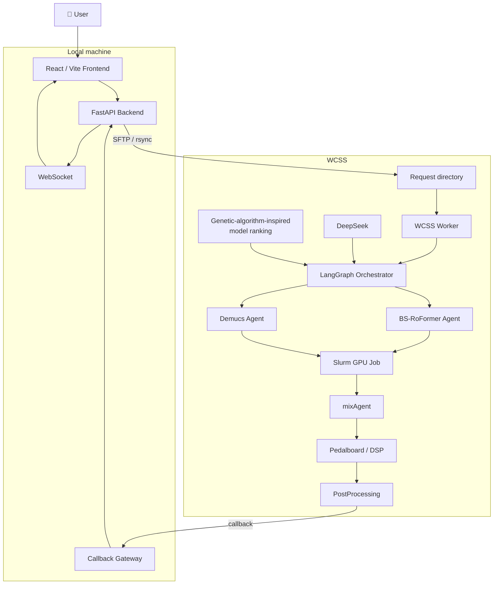

---

# 🔄 Production request flow

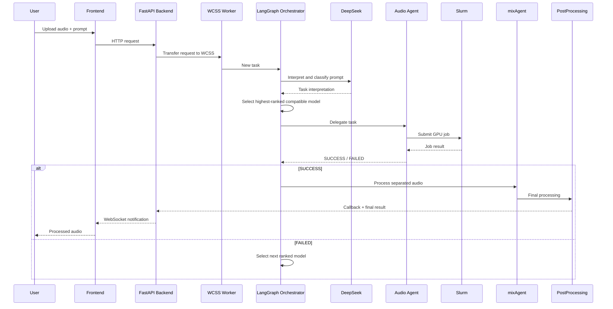

---

# 🧪 Diagnostics

Validate the configuration and perform a single request-directory scan:

```bash
python -m llm_agent.orchestrator.wcss_worker \
  --config llm_agent/config.local.yaml \
  --once
```

Check running Slurm jobs:

```bash
squeue -u "$USER"
```

Inspect a Slurm job:

```bash
sacct -j JOB_ID \
  --format=JobID,State,ExitCode,Elapsed,MaxRSS
```

Run local pipeline tests:

```bash
python -m unittest -v llm_agent.tests.test_pipeline
```

Build the frontend:

```bash
npm --prefix SoundCraft_frontend run build
```

---

# 🛠️ Troubleshooting

| Problem | Possible cause |
|---|---|
| `NO_RESOURCES` | GPU resources unavailable or incorrect Slurm configuration |
| Long `PENDING` | Cluster queue, partition or QoS configuration |
| `FILE_NOT_FOUND` | Incorrect model, checkpoint or environment path |
| UI stays on `processing` | WCSS worker is not running or request paths do not match |
| DeepSeek request fails | Missing/invalid API key or network/API connectivity problem |

If the UI remains in the `processing` state, verify that:

```text
paths.request_root
backend.sftp_remote_path
backend.rsync_remote_path
```

all point to the same WCSS request directory.

---

# 📁 Repository structure

```text
SoundCraft/
│
├── PostProcessing/
├── SoundCraft_backend/
├── SoundCraft_frontend/
│
├── agent_bs_roformer/
├── demucs/
├── llm_agent/
├── mixAgent/
│
├── screenshots/
│   ├── view_1.png
│   ├── view_2.png
│   └── view_3.png
│
├── scripts/
│
├── INSTRUKCJA_URUCHOMIENIA.md
├── WCSS_ODTWORZENIE.md
├── manual.md
├── requirements-ui.txt
├── run_ui.py
├── LICENSE
└── README.md
```

---

# 🧰 Technology stack

## AI / orchestration

- DeepSeek
- LangGraph
- custom genetic-algorithm-inspired model ranking and selection

## Audio

- BS-RoFormer
- Demucs
- Pedalboard
- digital signal processing

## Backend

- Python
- FastAPI
- Uvicorn
- WebSocket
- Paramiko
- SFTP / rsync

## Frontend

- React
- Vite

## Infrastructure

- WCSS
- Slurm
- GPU jobs
- SSH

---

# 📌 Current active pipeline

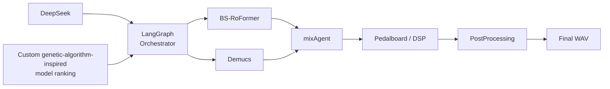

> **SAM Audio is currently excluded from the active processing pipeline.**

---

# 📚 Documentation

Detailed setup and deployment instructions:

[INSTRUKCJA_URUCHOMIENIA.md](INSTRUKCJA_URUCHOMIENIA.md)

LLM orchestrator documentation:

[llm_agent/README.md](llm_agent/README.md)

WCSS environment recreation:

[WCSS_ODTWORZENIE.md](WCSS_ODTWORZENIE.md)

Additional project documentation:

[manual.md](manual.md)

---

# 📜 License

SoundCraft is licensed under the [MIT License](LICENSE).
